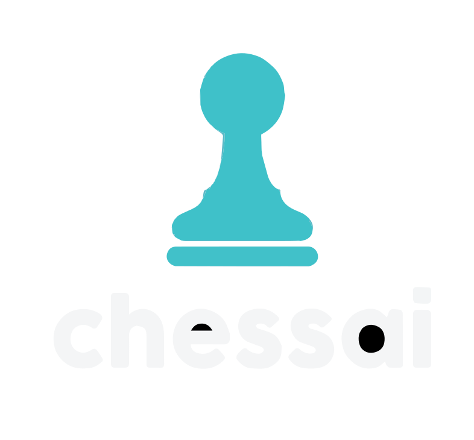

<p align="center">
    
</p>
<p align="center">
	<em><code>❯ Training of an AI using CNN, Residuals, advanced scheduler and optimizer</code></em>
</p>
<p align="center">
	
	
	
	
</p>
<p align="center"><!-- default option, no dependency badges. -->
</p>
<p align="center">
	<!-- default option, no dependency badges. -->
</p>
<br>

## 🔗 Table of Contents

- [📍 Overview](#-overview)
- [👾 Features](#-features)
- [📁 Project Structure](#-project-structure)
  - [📂 File Purpose](#-file-purpose)
- [🚀 Getting Started](#-getting-started)
  - [☑️ Prerequisites](#-prerequisites)
  - [⚙️ Installation](#-installation)
  - [🤖 Usage](#🤖-usage)
  - [🧪 Testing](#🧪-testing)
- [📌 Project Roadmap](#-project-roadmap)
- [🔰 Contributing](#-contributing)
- [🎗 License](#-license)
- [🙌 Acknowledgments](#-acknowledgments)

---

## 📍 Overview

This project uses Convolutional Neural Networks (CNNs) and advanced deep learning techniques to develop a chess-playing AI.
The AI is trained using residual connections, dynamic learning rate schedulers, and cutting-edge optimizers for superior performance and
scalability. It can predict optimal moves and simulate gameplay, making for a interesting way to experience chess.

---

## 👾 Features

<code>❯ Key highlights of this project include:</code>

- Integration of Stockfish for generating high-quality training data.
- Implementation of CNNs with residual layers for deep feature extraction.
- Support and usage for advanced learning rate scheduling and optimizers.
- Interactive GUI for playing against the AI.
- Comprehensive project structure with modular code for scalability.
<code></code>

---

## 📁 Project Structure

```
└── chessAI/
    ├── dup.py
    ├── engine.py
    ├── get_data.py
    ├── images
    │   ├── *.png
    │   ├── new.svg  # logo above
    ├── main.py
    ├── requirements.txt
    ├── training.py
    └── utils.py
```


### 📂 File Purpose
<blockquote>
    <table>
        <tr>
            <td>
                <b><a href='https://github.com/mp3skater/chessAI/blob/master/training.py'>training.py</a></b>
            </td>
            <td>
                <code>❯ Contains the training loop, dataset structure, and the AI model</code>
            </td>
        </tr>
        <tr>
            <td>
                <b><a href='https://github.com/mp3skater/chessAI/blob/master/dup.py'>dup.py</a></b>
            </td>
            <td>
                <code>❯ Checks how many lines are duplicates</code>
            </td>
        </tr>
        <tr>
            <td>
                <b><a href='https://github.com/mp3skater/chessAI/blob/master/utils.py'>utils.py</a></b>
            </td>
            <td>
                <code>❯ Some helper functions</code>
            </td>
        </tr>
        <tr>
            <td>
                <b><a href='https://github.com/mp3skater/chessAI/blob/master/get_data.py'>get_data.py</a></b>
            </td>
            <td>
                <code>❯ Get training data using Stockfish</code>
            </td>
        </tr>
        <tr>
            <td>
                <b><a href='https://github.com/mp3skater/chessAI/blob/master/main.py'>main.py</a></b>
            </td>
            <td>
                <code>❯ Contains GUI loop to play against the AI</code>
            </td>
        </tr>
        <tr>
            <td>
                <b><a href='https://github.com/mp3skater/chessAI/blob/master/engine.py'>engine.py</a></b>
            </td>
            <td>
                <code>❯ Handles the logic to load models and return best move</code>
            </td>
        </tr>
        <tr>
            <td>
                <b><a href='https://github.com/mp3skater/chessAI/blob/master/requirements.txt'>requirements.txt</a></b>
            </td>
            <td>
                <code>❯ Requirements for this project</code>
            </td>
        </tr>
    </table>
</blockquote>


---
## 🚀 Getting Started

### ☑️ Prerequisites

Before getting started with chessAI, ensure your runtime environment meets the following requirements:

- **Programming Language:** Python
- **Package Manager:** Pip


### ⚙️ Installation

Install chessAI using one of the following methods:

**Build from source:**

1. Clone the chessAI repository:
```
git clone https://github.com/mp3skater/chessAI.git
```


2. Navigate to the project directory:
```
cd chessAI
```


3. Install the project dependencies:


**Using pip** &nbsp; [](https://pypi.org/project/pip/)

```
❯ pip install -r requirements.txt
```


### 🤖 Usage
Run chessAI using the following command:
**Using pip** &nbsp; [](https://pypi.org/project/pip/)

sh
❯ python main.py


---
## 📌 Project Roadmap

- [X] **Task 1**: <strike>Implement a straightforward chess ai using supervised learning.</strike>
- [ ] **Task 2**: Implement a active learning model.
- [ ] **Task 3**: Code and test on a large server a MCTS based AI with improvements.

---

## 🔰 Contributing

- **💬 [Join the Discussions](https://github.com/mp3skater/chessAI/discussions)**: Share your insights, provide feedback, or ask questions.
- **🐛 [Report Issues](https://github.com/mp3skater/chessAI/issues)**: Submit bugs found or log feature requests for the chessAI project.
- **💡 [Submit Pull Requests](https://github.com/mp3skater/chessAI/blob/main/CONTRIBUTING.md)**: Review open PRs, and submit your own PRs.

<details closed>
<summary>Contributing Guidelines</summary>

1. **Fork the Repository**: Start by forking the project repository to your github account.
2. **Clone Locally**: Clone the forked repository to your local machine using a git client.

```
   git clone https://github.com/mp3skater/chessAI
```

3. **Create a New Branch**: Always work on a new branch, giving it a descriptive name.
   
```
   git checkout -b new-feature-x
```

4. **Make Your Changes**: Develop and test your changes locally.
5. **Commit Your Changes**: Commit with a clear message describing your updates.
   
```
   git commit -m 'Implemented new feature x.'
```

6. **Push to github**: Push the changes to your forked repository.
   
```
   git push origin new-feature-x
```

7. **Submit a Pull Request**: Create a PR against the original project repository. Clearly describe the changes and their motivations.
8. **Review**: Once your PR is reviewed and approved, it will be merged into the main branch. Congratulations on your contribution!
</details>

<details closed>
<summary>Contributor Graph</summary>
<br>
<p align="left">
   <a href="https://github.com{/mp3skater/chessAI/}graphs/contributors">
      
   </a>
</p>
</details>

---

## 🎗 License

This project is protected under the [MIT-LICENSE](https://mit-license.org/) License. For more details, refer to the [LICENSE](https://choosealicense.com/licenses/) file.

---

## 🙌 Acknowledgments

- Credits go out to [Scier](https://www.youtube.com/@scierknave) for his chess AI tutorial where I let myself get some inspiration: [video](https://youtu.be/4qwFwdCcgac)

---
